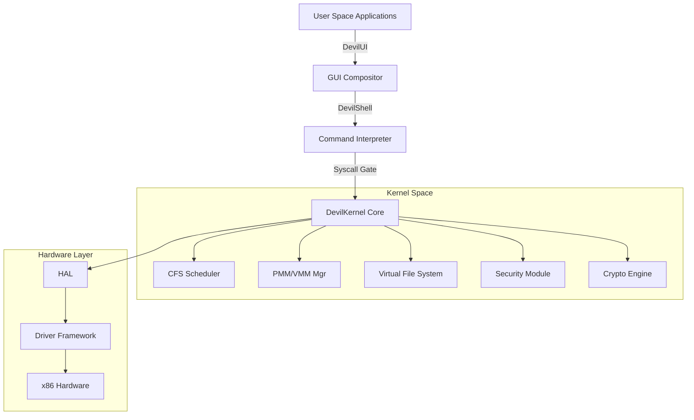

# 👿 DevilCore OS
**A Privacy-Focused, Ethical Hacking Operating System built from Scratch.**

[](LICENSE)
[](https://github.com/)

## 👁️ Overview
DevilCore is a custom 32-bit monolithic operating system designed for security professionals and privacy enthusiasts. Unlike many "Linux distributions," DevilCore is built entirely from the ground up—from the bootloader entry point to the graphical compositor. 

The goal of the project is to provide a minimalist, highly anonymized environment that integrates essential ethical hacking tools directly into a custom kernel and GUI ecosystem.

---

## 🏗️ System Architecture

DevilCore follows a **Hybrid Monolithic** design, where essential services like networking, memory management, and process scheduling reside in the kernel for performance, while specialized tools can be loaded modularly.

### High-Level Design


### 🎯 Design Principles
1. **Minimal Footprint**: Targeted at < 500MB installation size and < 128MB RAM at idle.
2. **Privacy by Default**: Zero telemetry. Built-in hooks for kernel-level traffic anonymization.
3. **Security First**: Mandatory Access Control (MAC) and encrypted journaling filesystem (DevilFS).
4. **Hacker Friendly**: Built-in specialized toolkit for ethical hacking and network analysis.

---

## 🛠️ Current Implementation

### 🚀 Booting & Kernel
- **Boot Protocol**: Multiboot-compliant. Effortlessly loaded by GRUB.
- **Video Mode**: Automatically requests a **1024x768 32-bpp** linear framebuffer during boot.
- **Memory Management**: Implements a kernel heap with block headers and allocation tracking (`__heap_base`).
- **Interrupts**: Baseline GDT and IDT setup for handle hardware events.

### 🖼️ DevilUI (Graphical Subsystem)
- **Software Compositor**: A double-buffered rendering engine located in `kernel/gui/compositor.c`. 
- **Double Buffering**: Prevents screen flickering by rendering to a back-buffer and blitting to VRAM only on frames.
- **Window Manager**: Supports multiple overlapping windows with managed headers and Z-order.
- **Typography**: Embedded 8x8 pixel font for native text rendering without external dependencies.

### ⌨️ I/O & Drivers
- **PS/2 Mouse Driver**: Fully functional polling driver with motion scaling and click detection.
- **PS/2 Keyboard Driver**: Supports standard US-QWERTY mapping with Shift-state tracking.
- **I/O Port Wrappers**: Optimized inline assembly for `inb`/`outb` operations.

---

## 📂 Project Structure
```text
.
├── kernel/
│   ├── kernel_boot.asm      # Multiboot entry point & header
│   ├── kernel.c             # Main kernel sequence & main loop
│   ├── include/             # Shared kernel headers
│   ├── gui/                 # Graphical engine & Window Manager
│   └── drivers/             # Hardware drivers (PS/2, I/O)
├── scripts/
│   ├── build.sh             # Master build script (compiles everything to ISO)
│   └── run_qemu.sh          # VM execution script
├── README.md                # This documentation
└── DevilCore.iso            # The final bootable OS image
```

---

## 🚀 Getting Started

### 📦 Prerequisites
You will need the following tools installed on your Linux host:
- `gcc` & `binutils` (with 32-bit multilib support)
- `nasm` (Netwide Assembler)
- `xorriso` & `grub-common` (for ISO creation)
- `qemu-system-x86` (for emulation)

### 🛠️ Building the OS
DevilCore uses a simplified build system that orchestrates the assembly and C compilation into a single bootable `DevilCore.iso`.
```bash
# Clone the repository
git clone https://github.com/your-username/DevilCore.git
cd DevilCore

# Execute the build script
./scripts/build.sh
```

### 💨 Running the Emulation
After building, you can launch the OS directly in QEMU:
```bash
./scripts/run_qemu.sh
```

---

## 🛡️ Security & Privacy Vision (Roadmap)
- [ ] **DevilFS**: Implementation of the native encrypted journaling filesystem.
- [ ] **Anonymity Core**: Kernel-level hooks for routing traffic through Tor/VPNs.
- [ ] **Sandboxing**: `Seccomp`-like module for restricting user-space processes.
- [ ] **Hacking Tools**: Native implementation of network scanners and packet sniffers.

---

## 📄 License
DevilCore is licensed under the **MIT License**. See `LICENSE` for more details.

---
*Built for the shadows. Developed by Antigravity.*