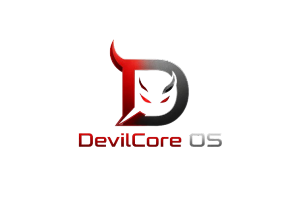

# 

# DevilCore OS v0.5 "Platinum Edition"
### The Ultimate Bare-Metal Operating System for Cyber Security, Hacking Research, and Systems Engineering.

**Lead Developer:** Mr. Nithish Kathiravan  
**Contact:** [nithishkathiravan123@gmail.com](mailto:nithishkathiravan123@gmail.com) / [infonity404@gmail.com](mailto:infonity404@gmail.com)  
**Phone/WhatsApp:** +91 9342358022  
**Architecture:** x86_64 (Long Mode)  
**Kernel Type:** Advanced Monolithic / Micro-Inspired  
**License:** Ethical Hacking Research License  
**Status:** Platinum Stable v0.5.0

---

## 🛡️ Executive Overview
DevilCore OS is an elite, 64-bit operating system engineered for the next generation of security researchers. Built entirely from scratch in C and Assembly, it bypasses the bloat of modern kernels to provide direct, deterministic access to hardware. The **Platinum Edition** marks a milestone in responsiveness, stability, and tool integration, featuring a bespoke software compositing engine and an overclocked input stack.

---

## 🚀 1. The Technological Infrastructure

### 1.1 Kernel Core & Boot Protocol
*   **Limine Implementation:** Utilizes the Limine boot protocol for transition from UEFI/BIOS to 64-bit Long Mode, ensuring a standardized handover of memory maps and framebuffer pointers.
*   **Global Descriptor Table (GDT):** Custom 64-bit GDT with specialized segments for Kernel Code/Data and User Code/Data, including TSS (Task State Segment) for hardware-assisted task switching.
*   **Interrupt Descriptor Table (IDT):** Complete implementation of 256 interrupt gates.
    *   **Exceptions (0-31):** Full handling for Page Faults, General Protection Faults, and Double Faults with diagnostic register dumps.
    *   **Hardware IRQs (32-47):** Remapped via the 8259 PIC to avoid conflict with CPU exceptions.
*   **Advanced System Calls:** Standardized 0x80 interface for user-space applications to request kernel services (I/O, IPC, Tasking).

### 1.2 Ultra-Low Latency Graphics (Platinum Engine)
*   **100Hz Refresh Rate:** The kernel-level software compositor (DevilUI) is optimized to render at a consistent 100 frames per second, eliminating input lag.
*   **64-Bit Data Path Optimization:** Core memory operations (`memcpy`, `memset`) utilize unrolled 64-bit loops to maximize memory bandwidth utilization during screen flips.
*   **Double Buffering:** Implements a full-screen backbuffer to eliminate flickering and tearing during complex window operations.
*   **Glass-Morphism Effects:** Real-time alpha-blending and vertical/horizontal gradients provide a modern "Platinum" aesthetic on bare metal.
*   **Centering Engine:** Dynamic resolution-independent centering for the boot splash and system dialogs.

### 1.3 High-Fidelity Input Stack
*   **Overclocked PS/2 Mouse Driver:** 
    *   **200Hz Sampling:** Requests maximum hardware polling for extreme smoothness.
    *   **Resolution Level 3:** High-precision positional data for pixel-perfect accuracy.
*   **Non-Linear Acceleration:** A custom mathematical curve maps hand movement to cursor velocity. Slow movements are precise (1:1), while rapid "flicks" accelerate up to 6x for fast navigation.
*   **Robust Synchronization:** A 3-byte state machine verifies every incoming PS/2 packet, automatically re-aligning the stream if desynchronization occurs during high-velocity movements.

---

## 🧠 2. Advanced Memory & Task Management

### 2.1 Paging & Virtual Memory (VMM)
*   **4-Level Paging:** Implementation of PML4, PDPT, PD, and PT structures for full 64-bit address space management.
*   **Higher-Half Kernel:** The kernel is mapped to `0xFFFFFFFF80000000`, reserving the lower address space for future high-performance user applications.
*   **Page Fault Mitigation:** Robust MMIO mapping logic ensures hardware drivers (like E1000) have secure, mapped access to their control registers.

### 2.2 Physical Memory Manager (PMM)
*   **Bitmap Allocation:** Every 4KB frame of physical RAM is tracked in a high-speed bitmap.
*   **O(1) Performance:** Optimized search algorithms ensure nearly instantaneous page allocation and deallocation.

### 2.3 CFS (Completely Fair Scheduler)
*   **Virtual Runtime (vruntime):** Ensures that every task receives a mathematically fair share of the CPU.
*   **Red-Black Tree Logic:** Tasks are stored in a balanced tree structure, allowing for O(log N) scheduling complexity.
*   **Priority Weighting:** Supports nice values (-20 to 19) for fine-grained control over task importance.

### 2.4 Slab Allocator
*   **Object Caching:** Specialized caches for frequently used structures (tasks, nodes, packets) to prevent heap fragmentation and improve allocation speed.

### 2.5 DevilCompress System
*   **Real-Time Compression:** Background RLE-based memory compression that shrinks idle pages, effectively "increasing" available system RAM by up to 30% without hardware changes.

---

## 📡 3. Networking & Security Suite

### 3.1 Gigabit Ethernet (Intel E1000)
*   **Direct MMIO:** High-performance driver with explicit memory mapping for the Intel 8254x series.
*   **Ring-Buffer Descriptors:** Optimized TX/RX queues for low-latency network communication.

### 3.2 Security Research Tools
*   **Network Sniffer (Sniffer.app):** Real-time ethernet frame analyzer capable of capturing and logging ARP, ICMP, and UDP packets.
*   **Severity Highlighting:** Automatically flags suspicious or diagnostic traffic in the live log.
*   **Protocol Handlers:**
    *   **ARP:** Full Address Resolution Protocol support for network discovery.
    *   **ICMP:** Integrated "Ping" capabilities for connectivity diagnostics.

---

## 📂 4. The Platinum Application Ecosystem

| App Name | Description | Tech Specs |
| :--- | :--- | :--- |
| **DevilShell** | The primary CLI interface. | Support for `neofetch`, `lspci`, `clear`, and `whoami`. |
| **File Manager** | VFS-based explorer. | Recursive directory walking, file-type icons, and size reporting. |
| **Network Scanner** | Live packet analyzer. | Severity-based logging and raw frame inspection. |
| **System Monitor** | Live kernel telemetry. | Real-time memory progress bars and CPU pulse animations. |
| **Text Editor** | Specialized code editor. | Basic C-style syntax highlighting and VFS save/load. |
| **Calculator** | Engineering calculator. | Scientific mode, history tape, and dynamic UI scaling. |
| **About System** | Branding and stats. | Centered high-fidelity logo and detailed versioning info. |

---

## 🛠️ 5. Development & Engineering

### Build Requirements
*   **Compilers:** `x86_64-elf-gcc` or `x86_64-linux-gnu-gcc`
*   **Assembler:** `nasm`
*   **Linker:** `ld` (GNU Linker) with custom `linker.ld` script.
*   **ISO Tooling:** `xorriso` and `grub-mkrescue` compatibility.

### Build Commands
```bash
# Clean previous build artifacts
make clean

# Compile the entire Platinum kernel and apps
make all

# Launch the environment in QEMU (Recommended)
make run
```

---

## 🗺️ 6. Engineering Roadmap
*   [ ] **USB 3.0 (XHCI) Integration:** Support for modern external peripherals.
*   [ ] **Lua Scripting Engine:** High-level scripting for rapid security tool development.
*   [ ] **FAT32 Write Support:** Enabling permanent storage on disk partitions.
*   [ ] **Audio Engine:** Implementation of Intel HD Audio for system alerts.

---

## 🤝 Contact & Global Support
For technical inquiries, collaboration on the **DevilCore Ethical Hacking Framework**, or custom kernel module development, contact:

**Mr. Nithish Kathiravan**  
📧 **Email:** [nithishkathiravan123@gmail.com](mailto:nithishkathiravan123@gmail.com)  
🌐 **GitHub:** [Shadowinfinitywarrior](https://github.com/Shadowinfinitywarrior/DevilCore-OS)  
📞 **WhatsApp:** +91 9342358022

---
*© 2026 DevilCore Systems. Developed for Research, Education, and Security Audit Purposes. All Rights Reserved.*
